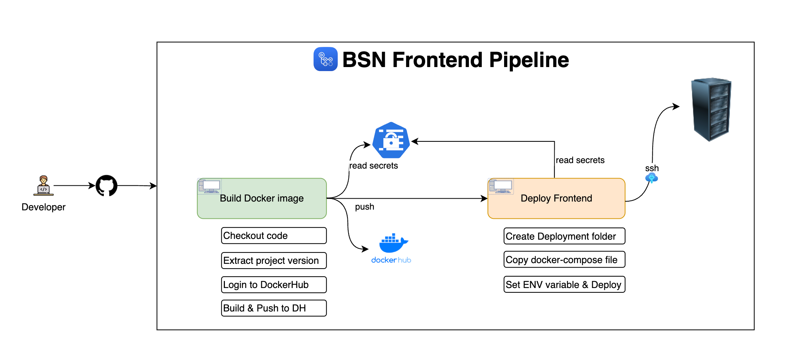

# Readdit

Welcome to **Readdit**! This is a social networking platform for book lovers, where users can add, share, and discover books. The platform allows users to follow others, exchange book recommendations, and build their personalized library. With user authentication and seamless interactions, Readdit brings the joy of reading to a social space.

## Features 🚀

- **Book Management**: Add, edit, and manage your personal library.
- **User Interaction**: Follow other users, exchange book recommendations, and share reviews.
- **Social Feeds**: See what books your friends are reading and their latest reviews.
- **Book Search and Recommendations**: Discover books based on user preferences and trending genres.
- **Secure Authentication**: User registration and login are secured with JWT.
- **Responsive Design**: User-friendly interface powered by Angular.

## Tech Stack 🛠️

- **Frontend**: Angular (TypeScript)
- **Backend**: Spring Boot (Java)
- **Database**: MySQL
- **Authentication**: JWT for secure user sessions

## Structure





## Installation and Setup ⚙️

To run Readdit locally, follow these steps:

1. **Clone the repository**:
    ```
    # Clone this repo
    git clone https://github.com/rujuldwivedi/Book-Network.git
    cd Readdit
    ```

2. **Backend Setup**:

   - Make sure you have **Java 11+** and **Maven** installed.
   - Set up the **MySQL database**:
      ```
      # Login to MySQL
      mysql -u root -p
      # Create the Readdit database
      CREATE DATABASE readdit;
      ```
   - Configure the database credentials in `application.properties`:
      ```
      # application.properties
      spring.datasource.url=jdbc:mysql://localhost:3306/readdit
      spring.datasource.username=yourUsername
      spring.datasource.password=yourPassword
      ```

   - Run the backend server:
      ```
      # Navigate to the backend folder
      cd backend
      # Run the Spring Boot application
      mvn spring-boot:run
      ```

3. **Frontend Setup**:

   - Make sure you have **Node.js** and **Angular CLI** installed.
   - Install dependencies and start the frontend server:
      ```
      # Navigate to the frontend folder
      cd frontend
      # Install Angular dependencies
      npm install
      # Run the Angular app
      ng serve --open
      ```

## Usage 🏃‍♂️

- Navigate to `http://localhost:4200` in your browser to start using Readdit.
- Sign up to create an account or log in with your existing credentials.
- Add books to your collection, share reviews, and follow other users to see their book recommendations.

## Contributing 🤝

We welcome contributions from the community. To contribute:

1. Fork the repository.
2. Create a new branch:
    ```
    # Create a new branch for your feature/bugfix
    git checkout -b feature-name
    ```
3. Commit your changes:
    ```
    # Commit your changes with a meaningful message
    git commit -m "Add feature: XYZ"
    ```
4. Push your branch:
    ```
    # Push to your forked repository
    git push origin feature-name
    ```
5. Create a Pull Request and describe the changes.

## Acknowledgements 🙏

- Inspired by the love for books and social networks.
- Thanks to *Bouli Ali* and to the open-source community for providing valuable tools and libraries.

---

Happy Reading! 📖✨
